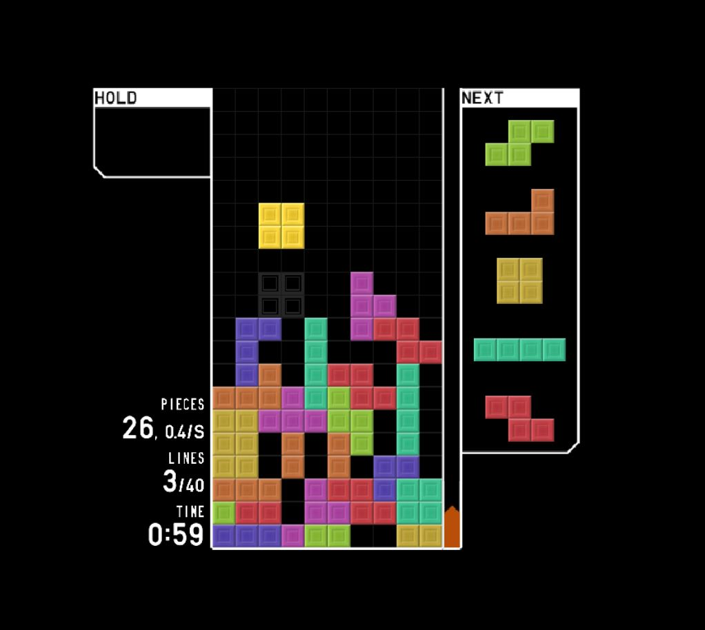

    <h1>Tetris Agent</h1>
    

This project aims to create an agent that plays Tetris on tetr.io automatically. It utilizes Selenium for automation and implements cv2 for computer vision.

## Table of Contents

- [Introduction](#introduction)
- [Installation](#installation)
- [Usage](#usage)
- [Dependences](#dependencies)
- [Contributing](#contributing)
- [License](#license)

## Introduction

In this project, we develop an agent that plays Tetris on tetr.io. The agent uses automated functions implemented with Selenium to interact with the game interface. Additionally, it utilizes cv2 for computer vision to analyze the game state and make intelligent decisions.

## Installation

To install and run this project, follow these steps:

1. Clone the repository: `git clone https://github.com/CesarFRR/isi_tetris_ia.git`
2. Install the required dependencies: `pip install -r requirements.txt`
3. We're using the python 3.11.5 version

## Usage

To use the Tetris agent, follow these steps:

1. Run the main script: `python main.py`
2. The agent will automatically launch the browser and start playing Tetris on tetr.io.

## Dependencies

- [Numpy](https://pypi.org/project/numpy/)
- [mss](https://pypi.org/project/mss/)
- [cv2](https://pypi.org/project/opencv-python/)
- [Selenium](https://pypi.org/project/selenium/)
- [Python Dotenv](https://pypi.org/project/python-dotenv/)
- [WebDriver Manager](https://pypi.org/project/webdriver-manager/)

Using python 3.11.5 (64-bit) | March 2024

## Contributing

We welcome contributions from the community. If you find any issues or have suggestions for improvements, please open an issue or submit a pull request.

## License

This project is licensed under the [MIT License](LICENSE).

## Authors

- Cesar Fabian Rincon Robayo ([GitHub](https://github.com/CesarFRR))
- John Jairo Riano Martinez ([GitHub](https://github.com/jorianom))

